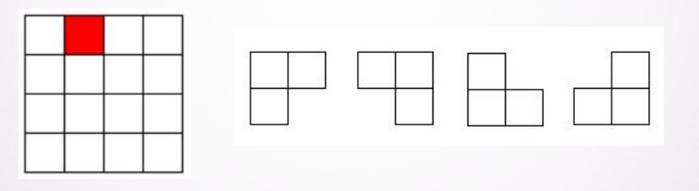
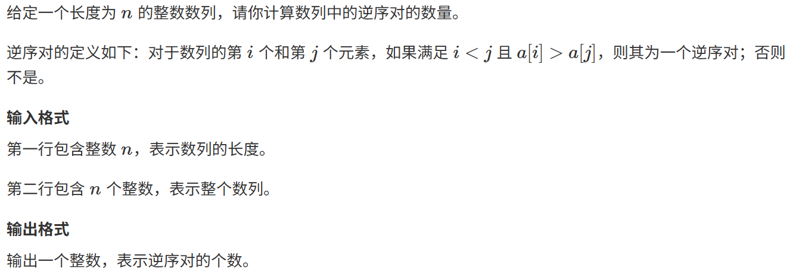

## 递归分治题型复习

### 1. 棋盘覆盖(个人感觉不会考这个)
##### 在一个2^k×2^k 个方格组成的棋盘中，恰有一个方格与其它方格不同，称该方格为一特殊方格，且称该棋盘为一特殊棋盘。在棋 盘覆盖问题中，要用图示的4种不同形态的L型骨牌覆盖给定的 特殊棋盘上除特殊方格以外的所有方格，且任何2个L型骨牌不 得重叠覆盖
  

```cpp
//棋盘覆盖问题 
//个人感觉考这个的概率相对来说要小一点(小很多其实) 

#include<iostream>
#include<stdio.h> 
#include<cmath>
using namespace std;
const int maxn = 128;  //假设棋盘最大尺寸  2^k, k<=7时MAXN=128够用(自行根据题目来看,错了别怪鄙人)
int board[maxn][maxn];    //棋盘，每个L骨牌用一个编号标识
int tileID = 0;  //骨牌编号，每每放下一个L型骨牌，就编号加1(说白了就是cnt)

//棋盘覆盖递归函数
//参数：tr, tc 为当前子棋盘左上角坐标；size 为子棋盘边长；dr, dc 为该子棋盘中特殊方格的位置坐标
void coverChessboard(int tr, int tc, int size, int dr, int dc) {
    if(size == 1) {
        return; //子棋盘仅1格，无需覆盖
    }
    tileID++;
    int t = tileID;  //当前使用的L骨牌编号
    int half = size / 2;
    //四个子棋盘的特殊方格初始坐标
    int special[4][2] = {
        {tr + half - 1, tc + half - 1},   //左上子棋盘的特殊格默认在右下角
        {tr + half - 1, tc + half},  //右上子棋盘特殊格默认在左下角
        {tr + half, tc + half - 1},  //左下子棋盘特殊格默认在右上角
        {tr + half, tc + half}   //右下子棋盘特殊格默认在左上角
    };

    //将特殊方格所在的子棋盘对应的默认特殊位置改为真正特殊方格位置
    //其他三个子棋盘则使用中心骨牌覆盖默认特殊格
    if(dr < tr + half && dc < tc + half) {
        //特殊方格在左上子棋盘
        special[0][0] = dr;
        special[0][1] = dc;
    } else {
        //覆盖左上子棋盘中心格
        board[tr + half - 1][tc + half - 1] = t;
    }
    if(dr < tr + half && dc >= tc + half) {
        //特殊方格在右上子棋盘
        special[1][0] = dr;
        special[1][1] = dc;
    } else {
        //覆盖右上子棋盘中心格
        board[tr + half - 1][tc + half] = t;
    }
    if(dr >= tr + half && dc < tc + half) {
        //特殊方格在左下子棋盘
        special[2][0] = dr;
        special[2][1] = dc;
    } else {
        //覆盖左下子棋盘中心格
        board[tr + half][tc + half - 1] = t;
    }
    if(dr >= tr + half && dc >= tc + half) {
        //特殊方格在右下子棋盘
        special[3][0] = dr;
        special[3][1] = dc;
    } else {
        //覆盖右下子棋盘中心格
        board[tr + half][tc + half] = t;
    }

    // 递归覆盖四个子棋盘
    coverChessboard(tr,tc,half, special[0][0], special[0][1]); // 左上
    coverChessboard(tr,tc + half, half, special[1][0], special[1][1]); // 右上
    coverChessboard(tr + half, tc, half, special[2][0], special[2][1]); // 左下
    coverChessboard(tr+ half, tc + half, half, special[3][0], special[3][1]); // 右下
}

int main() {
    int k;  
	cin>>k; 
	
    int boardSize = pow(2,k);  // 2^k
    //初始化棋盘，-1表示特殊方格
    for(int i=0; i<boardSize; ++i)
        for(int j=0; j<boardSize; ++j)
            board[i][j] = 0;
    //示例：假设题目说特殊方格在棋盘位置(1, 2),在实际应用中此位置由输入指定
    int special_r = 1, special_c = 2;
    board[special_r][special_c] = -1;
    coverChessboard(0, 0, boardSize, special_r, special_c);
    cout << "L型骨牌覆盖结果（输出骨牌编号）:" << endl;
    
    //可视化一下 
    for(int i=0; i<boardSize; ++i) {
        for(int j=0; j<boardSize; ++j) {
            if(board[i][j] == -1)
                cout << " * ";  //特殊方格
            else
                printf("%2d ",board[i][j]);
        }
        cout << endl;
    }
    //output result
    cout << "总骨牌数: " << tileID << endl;
    return 0;
}

```

### 2.归并排序MergeSort
##### 这个我个人感觉大概率会考的！直接上代码
```cpp
//归并(合并)排序
//个人感觉相比于考棋盘，考这个的概率大一点，因为这个题编写代码的时间要短很多，而且模板好背

#include<iostream>
#include<algorithm>
using namespace std;

const int N = 100010;
int n; //input
int sequence[N];
int tmp[N];

void mergeSort(int l,int r,int *se){
	if(l>=r)return;
	int mid = l+r>>1;
	//注意与快排的区别 
	mergeSort(l,mid,se),mergeSort(mid+1,r,se);
	int i = l,j = mid+1,k = 0;
	while(i<=mid && j<=r){
		if(se[i]<=se[j]){
			tmp[k++] = se[i++];
		}
		else{
			tmp[k++] = se[j++];
		}
	}
	//防止有没操作完对的数
	while(i<=mid)tmp[k++] = se[i++];
	while(j<=r)tmp[k++] = se[j++];
	//扫尾，load sequence 2 the "sequence"array from tmp
	for(int i=l,j=0;i<=r;i++,j++)se[i] = tmp[j];
} 

int main(){
	cin>>n;
	for(int i=0;i<n;i++)cin>>sequence[i];
	mergeSort(0,n-1,sequence);
	for(int i = 0;i<n;i++)cout<<sequence[i]<<" ";
	cout<<endl;
	return 0;
}
```
### 3.逆序对数量
##### 本来有一个线性时间选择的题(找序列中第k小的数，这个代码先排序再选很简单的就不写了)
##### 归并排序有许多应用，这里就拿逆序对数量实践
  

```cpp
//逆序对的数量(归并排序的应用) 
//给定一个长度为 n的整数数列，请你计算数列中的逆序对的数量。

#include<iostream>
#include<algorithm>
using namespace std;

const int N = 100010;
int n; //input
int sequence[N];
int tmp[N];

int result = 0;

void mergeSort(int l,int r,int *se){
	if(l>=r)return;
	int mid = l+r>>1;
	//注意与快排的区别 
	mergeSort(l,mid,se),mergeSort(mid+1,r,se);
	int i = l,j = mid+1,k = 0;
	while(i<=mid && j<=r){
		if(se[i]<=se[j]){
			tmp[k++] = se[i++];
		}
		else{
			tmp[k++] = se[j++];
			result+=mid+1-i;  //mid+1-i 也就是当前分治情况下所有的逆序对数量 
		}
	}
	//防止有没操作完对的数
	while(i<=mid)tmp[k++] = se[i++];
	while(j<=r)tmp[k++] = se[j++];
	//扫尾，load sequence 2 the "sequence"array from tmp
	for(int i=l,j=0;i<=r;i++,j++)se[i] = tmp[j];
} 

int main(){
	cin>>n;
	for(int i=0;i<n;i++)cin>>sequence[i];
	mergeSort(0,n-1,sequence);
//	for(int i = 0;i<n;i++)cout<<sequence[i]<<" ";
//	cout<<endl;
	cout<<result<<endl;
	return 0;
}
```

#### 那么，递归分治的例题就这么几个，递归分治是最好拿分的，祝考试顺利 :D