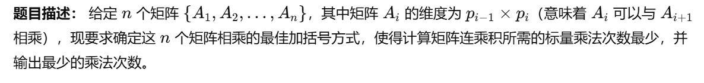
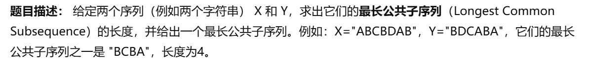
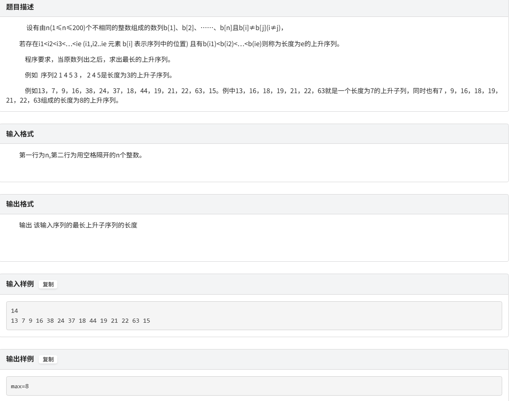
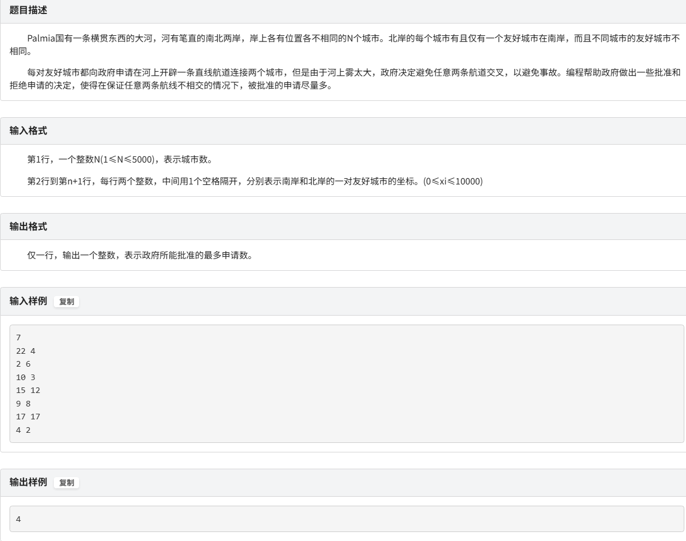
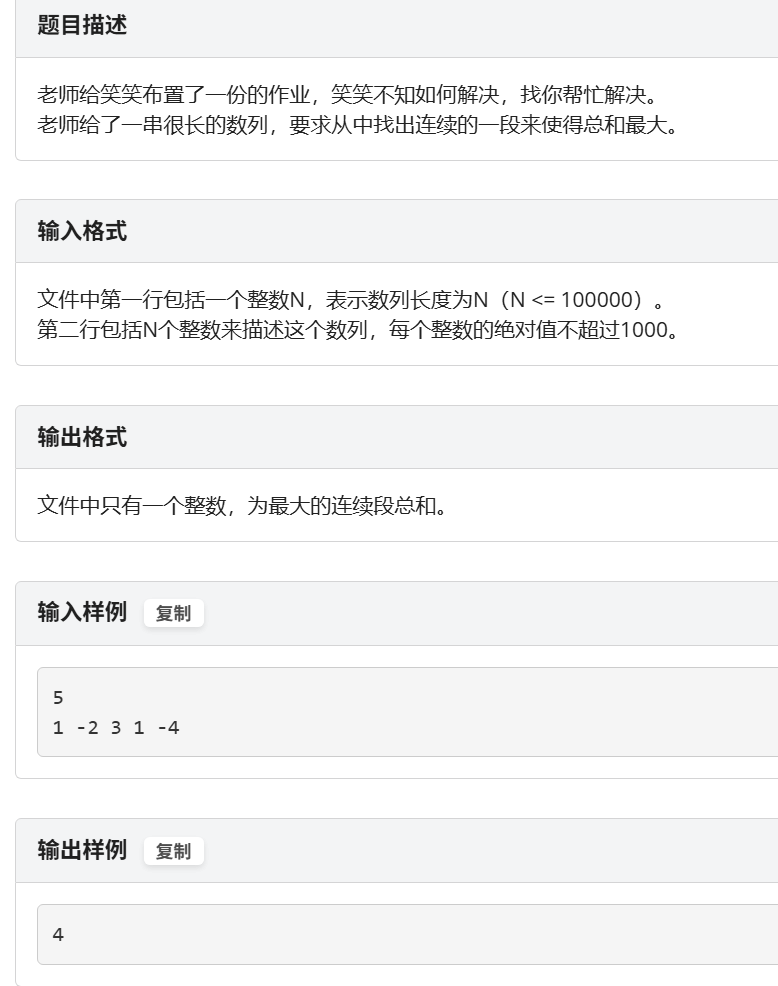
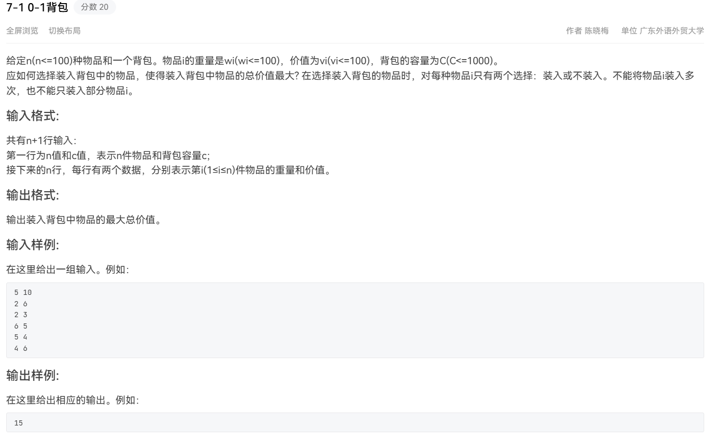
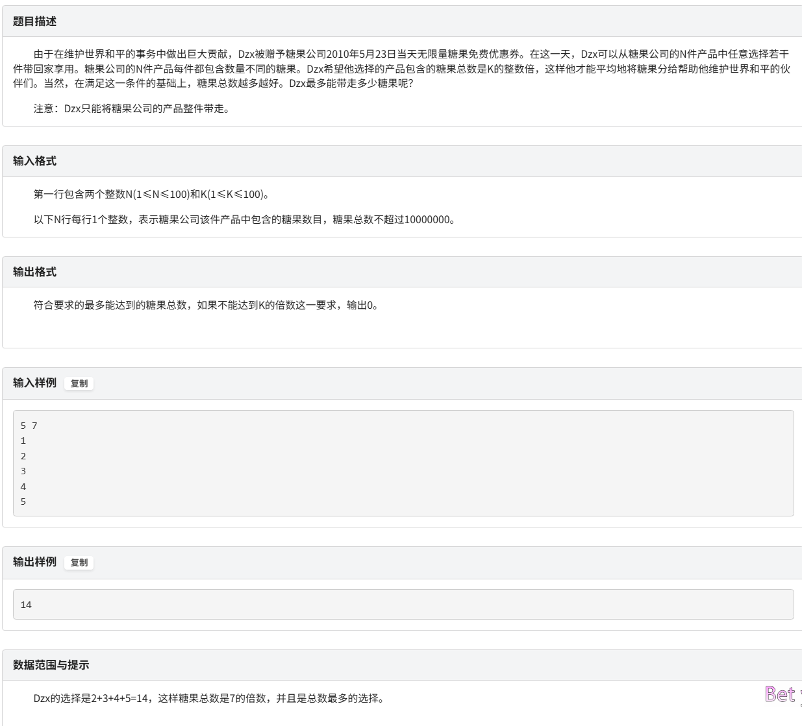

## 动态规划题型复习
#### *Notice - DP问题个人觉得 01背包和LCS问题最可能考，矩阵乘法、电路。流水线这些不太适合过关性考试*

### 1. 矩阵连乘(非常经典的DP问题，35%的概率会考吧...)
  

```python
#该题的大致代码框架:
先枚举链长 len（从小问题到大问题）
  再枚举起点 i
    再枚举断点 k（i ≤ k < j）
      更新 m[i][j] 最优值 = 左边 + 右边 + 合并代价
```

#### 理解起来有点困难,先举个例子:
##### Q:当前断法的代价 = 左边子问题的最优解 + 右边子问题的最优解 + 最后合并这两个矩阵的代价   这是什么意思呢？
```md
1.加括号:
假如你有4个矩阵 A1,A2,A3,A4
那么如果想要加括号，比如说这样: (A1 x A2) x (A3 x A4)

那你就要先把：
A2 × A3 算出来（这是一个子问题）
A4 × A5 算出来（也是一个子问题）
最后再把上面这两个“矩阵乘积结果”继续相乘（就是合并）

2.每次拆解成2个子链:
设我们当前处理的子问题是 m[i][j]，比如 m[2][5]（即 A2 × A3 × A4 × A5）
维度数组p = {30, 35, 15, 5, 10, 20, 25}

你选一个断点 k，假设为 3，把它拆成两部分：
左边子问题是：A2 × A3 → 记为 m[2][3]
右边子问题是：A4 × A5 → 记为 m[4][5]

这两个子问题你肯定前面已经递推算出来了

3.合并两个子链的计算代价是怎么算的？
如果你现在：
A2 × A3 结果是一个 矩阵 X，它的维度是 p[1] × p[3]
A4 × A5 结果是一个 矩阵 Y，它的维度是 p[3] × p[5]

要把 X × Y 相乘，你要做多少次乘法？
公式是：
行数 × 公共维数 × 列数 = p[1] × p[3] × p[5]
所以这就是最后合并两个子问题结果的代价。

4.那么来看公式:m[i][j] = m[i][k] + m[k+1][j] + p[i-1] * p[k] * p[j]
m[i][k]     	    左边子问题最优解，即 Ai~Ak 连乘的最小乘法次数
m[k+1][j]	        右边子问题最优解，即 Ak+1~Aj 连乘的最小乘法次数
p[i-1]*p[k]*p[j]	合并左右两个乘积矩阵时，所需的乘法次数（因为左边结果是 p[i-1]×p[k]，右边是 p[k]×p[j]）


如果还是昏的，那么看下面：
假设:
A2 是 35×15
A3 是 15×5
A4 是 5×10
A5 是 10×20
那么:
m[2][3] = A2×A3 的最优代价 = 35×15×5 = 2625
m[4][5] = A4×A5 的最优代价 = 5×10×20 = 1000
合并代价 = A2×A3 × A4×A5 = p[1]×p[3]×p[5] = 35×5×20 = 3500

```

#### 这里通过示例代码来理解

```cpp
#include <iostream>
using namespace std;

const int MAXN = 105;
const long long INF = 1e18;

long long m[MAXN][MAXN]; //m[i][j]：从Ai乘到Aj的最小乘法次数
int s[MAXN][MAXN];  //s[i][j]：从Ai乘到Aj的最优断点位置

//可视化输出最优加括号方式  额不用看这个
void printParenthesis(int i, int j) {
    if (i == j) {
        cout << "A" << i;
        return;
    }
    cout << "(";
    printParenthesis(i, s[i][j]);    //左侧子结构
    cout << " x ";
    printParenthesis(s[i][j] + 1, j);   //右侧子结构
    cout << ")";
}

int main() {
    int n = 6;
    int p[] = {30, 35, 15, 5, 10, 20, 25}; //矩阵维度：A1=30x35, A2=35x15,...A6=20x25

    //初始化：m[i][i] = 0（单个矩阵乘法代价为0）
    for (int i = 1; i <= n; ++i) {
        m[i][i] = 0;
    }

    //计算链长从2开始的所有子问题
    for (int len = 2; len <= n; ++len) {
        for (int i = 1; i <= n - len + 1; ++i) {
            int j = i + len - 1;
            m[i][j] = INF;
            for (int k = i; k < j; ++k) {
                long long cost = m[i][k] + m[k+1][j] + 1LL * p[i-1] * p[k] * p[j];
                if (cost < m[i][j]) {
                    m[i][j] = cost;
                    s[i][j] = k;  //记录断点
                }
            }
        }
    }

    cout << "最少乘法次数: " << m[1][n] << endl;
    cout << "最优加括号方式: ";
    printParenthesis(1, n);
    cout << endl;

    return 0;
}

```


### 2. 最长公共子序列(LCS) (这个考的可能性高一点)
  

```cpp
//注意，这里序列是纯数字序列，不是字符串
#include<bits/stdc++.h>
using namespace std;
const int N = 100;
int a[N], b[N], dp[N][N];

vector<int>lcs_seq;  //输出序列用-用来存储LCS序列

int main(){
    int n, m;
    cin >> n >> m;
    for(int i = 1; i <= n; i++)cin >> a[i];
    for(int i = 1; i <= m; i++)cin >> b[i];
    
    //填dp表
    for(int i = 1; i <= n; i++) {
        for(int j = 1; j <= m; j++) {
            if(a[i] == b[j]) dp[i][j] = dp[i-1][j-1] + 1;
            else dp[i][j] = max(dp[i-1][j], dp[i][j-1]);
        }
    }

    //回溯找出LCS序列（从右下角开始往上回退）
    int i = n, j = m;
    while(i > 0 && j > 0) {
        if(a[i] == b[j]) {
            lcs_seq.push_back(a[i]);
            i--; j--;
        } else if(dp[i-1][j] >= dp[i][j-1]) {
            i--;
        } else {
            j--;
        }
    }

//    reverse(lcs_seq.begin(), lcs_seq.end());

    //输出结果
    cout << "LCS长度: " << dp[n][m] << endl;
    cout << "LCS序列: ";
    for(int i = lcs_seq.size() - 1; i >= 0; i--) cout <<lcs_seq[i]<< " ";
    cout << endl;

    return 0;
}

```

#### 细说一下代码:
```cpp
    //填dp表
    for(int i = 1; i <= n; i++) {
        for(int j = 1; j <= m; j++) {
            if(a[i] == b[j]) dp[i][j] = dp[i-1][j-1] + 1;
            else dp[i][j] = max(dp[i-1][j], dp[i][j-1]);
        }
    }
```
```python
我们在求：
dp[i][j] = a[1..i]和b[1..j]的最长公共子序列长度
如果当前字符 a[i] != b[j] 怎么办？
回忆一下我们做的事情：
我们现在看的是两个子序列：
a[1..i]
b[1..j]
但最后一个字符 不相等，也就是说：
a[i] != b[j]
那么很显然：
a[i] 不可能是公共子序列的结尾
b[j] 也不可能是公共子序列的结尾
所以，我们要把它们一个一个去掉试试看，选出更优的

所以我们看两个选择：
1. 去掉 a[i]，也就是看：
dp[i-1][j]
不考虑当前 a[i]，看看之前的状态长度是多少。
2. 去掉 b[j]，也就是看：
dp[i][j-1]
不考虑当前 b[j]，看看之前的状态长度是多少。
3. 最终我们取它们中“较大的一个”：
dp[i][j] = max(dp[i-1][j], dp[i][j-1]);
也就是说：
如果最后一个字符不相等，那就从“去掉 a[i]”和“去掉 b[j]”两种选择中找一个更长的子序列。
```
#### 最后再说一下回溯输出LCS序列的功能函数

状态：a[i], b[j]

1. 相等 → 把 a[i] 加入结果，i--, j--
2. 不等
   - 看是谁提供了最大值
   - 如果 dp[i-1][j] > dp[i][j-1] → 上方好 → i--
   - 否则左方好 → j--

一直退，直到 i==0 或 j==0。

```cpp
//最后是OJ上标准的代码,适用于只输出长度的情况，且输入的是字符串
#include <iostream>
#include <cstring>
#include <algorithm>
using namespace std;

const int N = 1000 + 5;
char X[N], Y[N];
//dp[i][j]表示X前i个字符（X[0..i-1]）与Y前j个字符（Y[0..j-1]）的LCS长度(最长子序列)
int dp[N][N];

int main(){
    cin >> X >> Y;  //这里不能用getline()会引入尾部或者空行的符号 
    int m = strlen(X);
    int n = strlen(Y);

    //初始化边界：dp[0][*]=dp[*][0]=0（静态分配已默为 0，可省略的）
    for(int i = 0; i <= m; i++) dp[i][0] = 0;
    for(int j = 0; j <= n; j++) dp[0][j] = 0;

    //DP
    for(int i = 1; i <= m; i++){
        for(int j = 1; j <= n; j++){
            if (X[i-1] == Y[j-1]) {
                //匹配上，可以在 dp[i-1][j-1] 基础上加 1
                dp[i][j] = dp[i-1][j-1] + 1;
            } else {
                //不匹配
                dp[i][j] = max(dp[i-1][j], dp[i][j-1]);
            }
        }
    }

    cout << dp[m][n] << "\n";
    return 0;
}
```


### 3. 最长上升子序列问题(LIS) (这个考的可能性与LCS差不多)
##### 3.1 基础LIS
  

```cpp
//最长上升子序列问题DP，与01背包其中一个不同的是每个f中要预先赋值1 

//以下是错误写法，因为没理解对题意，以下应该是最长连续的上升子序列问题。。。 
//#include<iostream>
//#include<algorithm>
//using namespace std;
//const int N = 205;
//
//int dp[N] = {0};  
//int n;
//int num[N];
//int main(){
//	cin>>n;
//	for(int i=1;i<=n;i++){
//		cin>>num[i];
//		dp[i] = 1;
//		
//	}
//	int ans = dp[1];
//	for(int i = 2;i<=n;i++){
//		if(num[i]<=num[i-1])
//			dp[i] = 1;
//		else{
//			dp[i] = dp[i-1]+1;
//		}
//		
//		ans = max(dp[i],ans);
//		cout<<"ans"<<ans<<endl;
//	}
//	cout<<ans<<endl;
//	return 0;
//}

//正确写法
#include<iostream>
#include<algorithm>
using namespace std;
const int N = 205;

int dp[N] = {0};  
int n;
int num[N];

int main(){
	cin>>n;
	for(int i=1;i<=n;i++){
		cin>>num[i];
		dp[i] = 1;
	}
	int ans = dp[1];
	
	for(int i= 2;i<=n;i++){
		for(int j=1;j<i;j++){
			if(num[j]<num[i]){
				dp[i] = max(dp[i],dp[j]+1);
			}
		}
		ans = max(ans,dp[i]);
	}
	cout<<"max="<<ans;
	return 0;
	
}

```

#### 3.2. 友好城市(LIS必刷题目)


```cpp
//这个DP问题可以有很好的转化思路，先对于南岸坐标按从小到大排序，若坐标相同则按北岸从小到大排序
//再对于北岸按照对应南岸的顺序排序，接着就是可以借鉴递增子序列的思路来做了 

#include <iostream>
#include <algorithm>
using namespace std;

const int N = 5005;   

int south[N];   // 南岸坐标
int north[N];   // 北岸坐标
int idx[N];     // 排序用下标
int seq[N];     // 排序后得到的北岸序列
int dp[N];      // 最长递增子序列 (LIS)

// 比较函数：先按 south 升序，若相等再按 north 升序
bool cmp(int i, int j)
{
    if (south[i] != south[j]) return south[i] < south[j];
    return north[i] < north[j];
}

int main()
{
    int n;
    cin >> n;

    for (int i = 1; i <= n; ++i) {
        cin >> south[i] >> north[i];
        idx[i] = i;           // 初始化下标数组
        dp[i] = 1; 
    }

    // 1. 对下标数组排序
    sort(idx + 1, idx + n + 1, cmp);

    // 2. 生成按 south 排序后的 north 序列
    for (int k = 1; k <= n; ++k) seq[k] = north[idx[k]];

    // 3. 在 seq[] 上求最长严格递增子序列（O(N2) DP）
    int ans = dp[1];
    for (int i = 2; i <= n; ++i) {
        for (int j = 1; j < i; ++j)
            if (seq[j] < seq[i])  //if (seq[j] < seq[i] && dp[j] + 1 > dp[i])dp[i] = dp[j]+1整个if就是这个意思啦 
                dp[i] = max(dp[i],dp[j] + 1);
        if (dp[i] > ans) ans = dp[i];
    }

    cout << ans;
    return 0;
}

```

### 4. 最大子段和问题(考这个的概率65% ！！！)
  

#### *给你一个长度为 n 的数组 num[]，你要找出一段连续子数组，使得它们的和最大。这段和就叫最大子段和。*
#### *注意！！这里的子段是连续的！！！和子序列的概念不一样！！！！*

```cpp
#include<iostream>
#include<algorithm>
using namespace std;

const int N = 1e5+10;

int n;
int num[N];
int current_max;  // 当前以 num[i] 结尾的最大子段和
int res; //全局最大和

int main(){
	cin>>n;
	for(int i=0;i<n;i++)cin>>num[i];
		
	current_max = num[0];  // 初始化：以第一个数结尾的最大和是它本身
	res = num[0];
	
	for(int i=1;i<n;i++){
		current_max = max(current_max+num[i],num[i]);
		res = max(current_max,res);
//		cout<<res<<endl;
	}
	cout<<res;
	return 0;
} 
```

### 5.背包问题(这个包要考的！ 可能是基础0-1背包也可能是变体)

#### 5.1. 0-1背包问题


```cpp
#include <iostream>
using namespace std;

const int N = 1010;
int n, m;
int v[N], w[N]; //v:volume w:worth  呃呃这里跟题目的不一样，但是思路到位就行
int f[N][N];  //前n个物品，容量为 m的最大价值

int main() {
    cin >> n >> m;
    for (int i = 1; i <= n; i ++ ) cin >> v[i] >> w[i];

    for (int i = 1; i <= n; i ++ )   //枚举物品
        for (int j = 1; j <= m; j ++ ) {  //枚举容量（背包）
            f[i][j] = f[i - 1][j];  //不选第 i 个物品
            if (j >= v[i]) f[i][j] = max(f[i][j], f[i - 1][j - v[i]] + w[i]);
        }
    cout << f[n][m]; //输出前 n个物品，容量为 m的最大价值
    return 0;
}

```
#### 5.2. 简单背包问题变体


```cpp
//对一个和能否被K整除，只看它对 K的余数就够了。令dp[r]表示当前已处理完若干商品时，能得到余数r的最大糖果总数（取不到则记为 -1)
#include <iostream>
#include <cstring>    //为了memset
using namespace std;

const int N = 105;      
long long dp[N], tmp[N]; //dp是当前已看过的商品里，能组成余数 r时最大的糖果总数 

int main()
{
    int n, k;
    if (!(cin >> n >> k)) return 0;

    //初始化 dp
    memset(dp, -1, sizeof(dp));
    dp[0] = 0;    //不拿任何商品→余数 0，和为 0

    //逐件商品更新
    for (int i = 0; i < n; ++i) {
        long long val; cin >> val;

        memcpy(tmp, dp, sizeof(dp));    //先把旧状态复制到 tmp
        for (int r = 0; r < k; ++r)
            if (dp[r] != -1) {
                long long new_sum = dp[r] + val;
                int new_r = new_sum % k;
                if (new_sum > tmp[new_r]) tmp[new_r] = new_sum;
            }
        memcpy(dp, tmp, sizeof(dp));    //写回 dp
    }

    cout << dp[0]; //最大且能被k整除的糖果数
    return 0;
}

```


