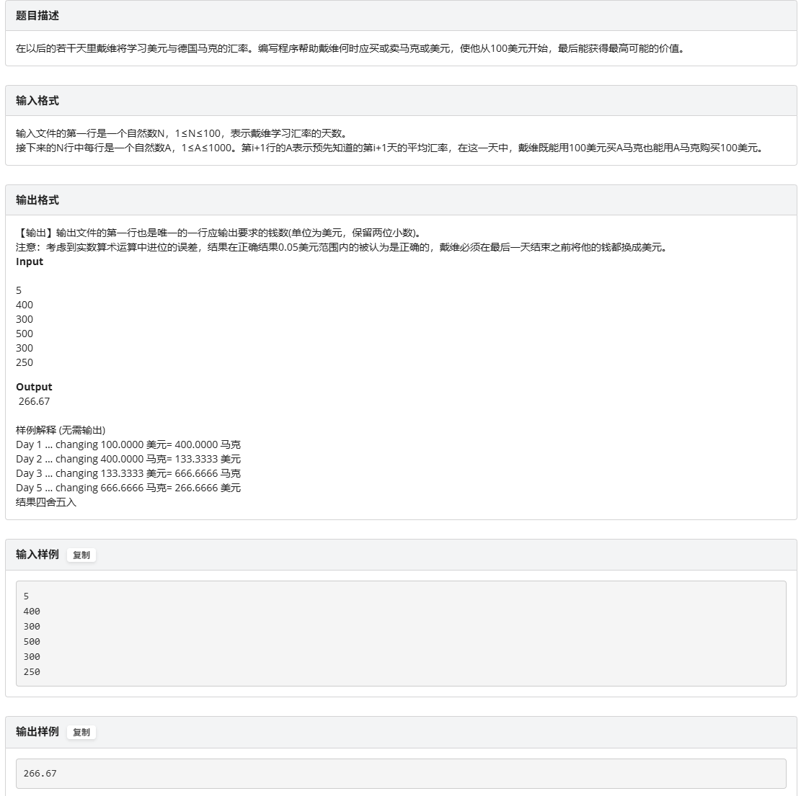
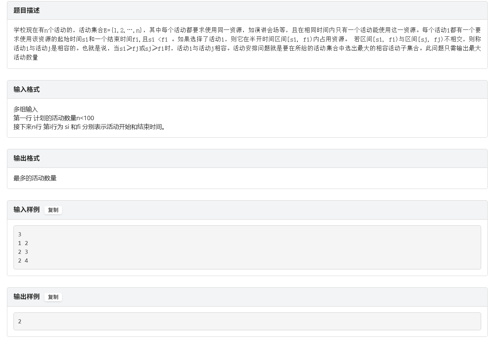
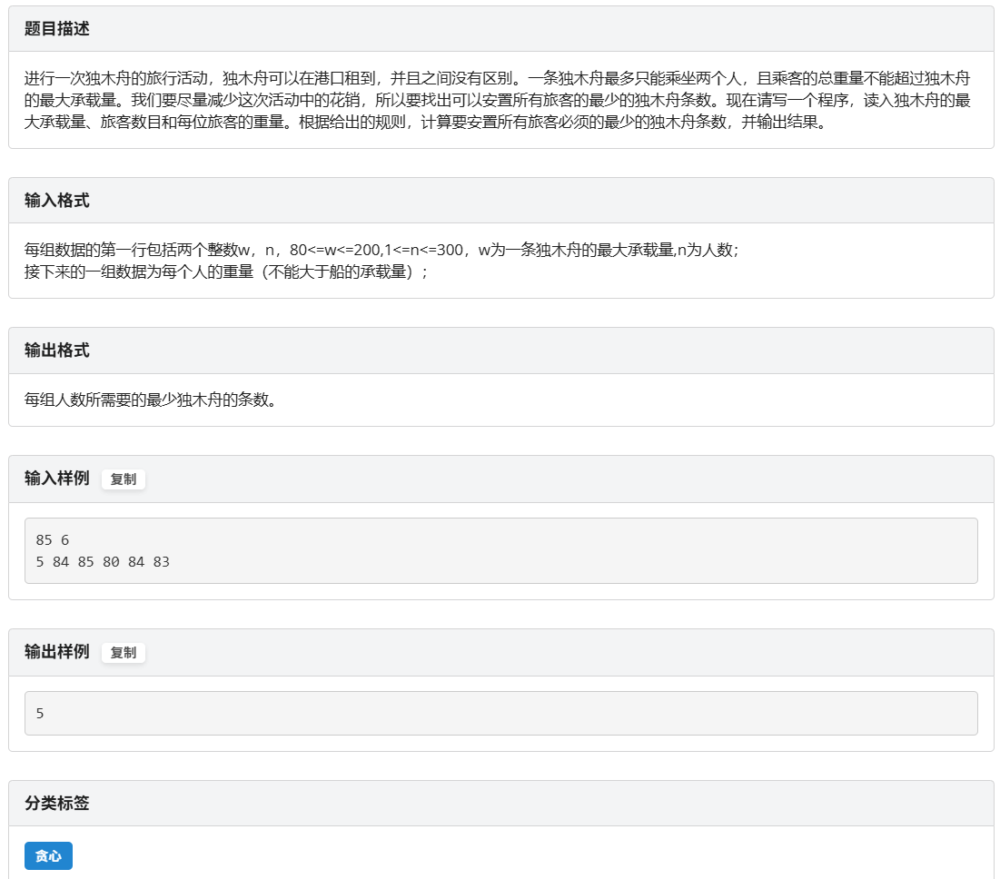
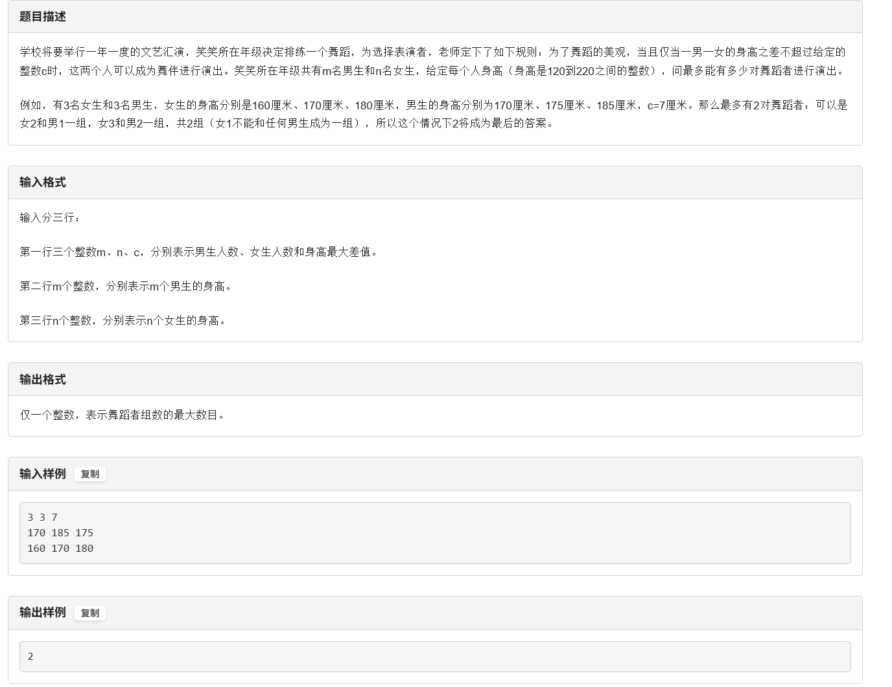

## 动态规划题型复习

### 0. 基础贪心练手(练手题)


```cpp
#include<iostream>
#include<algorithm>
#include<iomanip>
using namespace std;

const int N = 100010;
int n;
int conv;
double dollars=100.00;
double mark = 0.00;
int main(){
	cin>>n;
	while(n--){
		cin>>conv;
		double new_dollars = max(dollars,mark*100/conv);
		double new_mark = max(mark,dollars*conv/100);
		dollars = new_dollars;
		mark = new_mark;
	}
	cout<<fixed<<setprecision(2)<<dollars<<endl;
	return 0;
} 
```

### 1. 活动安排问题(70%的概率考)
  

```cpp
#include <iostream>
#include <algorithm>
using namespace std;

const int MAXN = 100;
int start[MAXN], endt[MAXN]; //存储每个活动的开始和结束时间
int idx[MAXN]; //用于排序活动索引

//自定义排序函数：按endt[i]升序排列活动
bool cmp(int a, int b) {
    return endt[a] < endt[b];
}

int main() {
    int n;
    cin >> n;

    for (int i = 0; i < n; ++i) {
        cin >> start[i] >> endt[i]; //读入第 i 个活动的开始和结束时间
        idx[i] = i; //初始化索引数组
    }

    //将活动索引按照对应endt排序，实现“按结束时间排序”
    sort(idx, idx + n, cmp);

    int count = 0;     //统计最多能安排的活动数
    int last_end = 0;  //上一个选中活动的结束时间

    for (int i = 0; i < n; ++i) {
        int k = idx[i]; //取出排好序后的活动编号
        if (start[k] >= last_end) {
            count++;             //活动可选，计数 +1
            last_end = endt[k];  //更新“当前选中活动的结束时间”
        }
    }

    cout << count << endl; //输出最多可安排的活动数量
    return 0;
}

```

### 2.哈夫曼编码(个人觉得考这个概率不高)
##### *所以我就没打算复习这个了，直接战略性不写题解了*

### 3.单源最短路径问题Dijkstra(考这个的概率估计在40%左右)
```go
单源最短路径问题：给定带权有向图 G =(V,E)，其中每条边的权是非负实数。另外，还给定V中的一个顶点，称为源。现在要计算从源到所有其它各顶点的最短路长度。这里路的长度是指路上各边权之和。这个问题通常称为单源最短路径问题。
```
### 4. 最小生成树问题(考这个概率40%左右)
```go
最小生成树问题：设 G =(V,E)是无向连通带权图，即一个网络。E 中每条边(v,w)的权为 c[v][w]。如果 G 的子图G’是一棵包含 G 的所有顶点的树，则称 G’为 G 的生成树。生成树上各边权的总和称为该生成树的耗费。在 G 的所有生成树中，耗费最小的生成树称为 G 的最小生成树
```
### 5. 贪心必刷(贪心+双指针)
  

```cpp
//巧妙采用双指针完成贪心
#include<iostream>
#include<iomanip>
#include<cstring>
#include<algorithm>
using namespace std;

const int N = 1005;
int w,n;
int weights[N]={0};

int main(){
	cin>>w>>n;
	for(int i=0;i<n;i++){
		cin>>weights[i];
	}
	//先排序
//	sort(weights.begin(),weights.end();  vector可以这样用 
    sort(weights,weights+n); 
	
	int left = 0,right = n-1;
	int cnt=0;
	
	while(left<=right){
		if(weights[left]+weights[right]<=w){
			left++;
			right--;
		}else{
			right--;
		}
		cnt++;
	} 
	cout<<cnt<<endl;
	return 0;
}
```

### 6. 贪心必刷2
  

```cpp
#include <iostream>
#include <algorithm>
using namespace std;
const int N = 1005;
int main()
{
	int male[N], fmale[N];
	int m, n, c;
	cin >> m >> n >> c;
	for (int i = 0; i < m; i++) {
		cin >> male[i];
	}
	
	for (int i = 0; i < n; i++) {
		cin >> fmale[i];
	}
	sort(male, male + m);
	sort(fmale, fmale + n);
	int i = 0, j = 0, count = 0;
	while (i < m && j < n) {
		if (abs(male[i] - fmale[j]) <= c) {
			count++;
			i++;
			j++;
		}
		else {
			if (male[i] < fmale[j]) {
				i++;
			}
			else {
				j++;
			}
		}
	}
	cout << count;
}
```