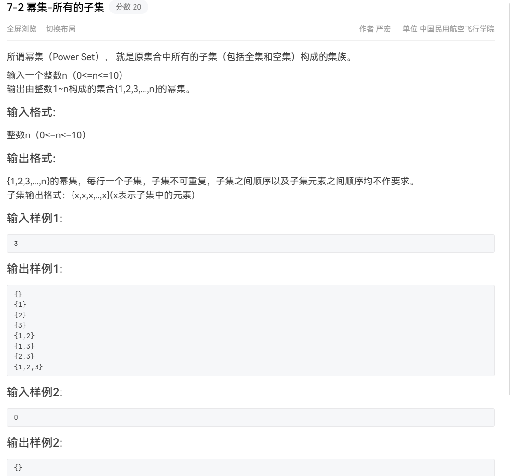
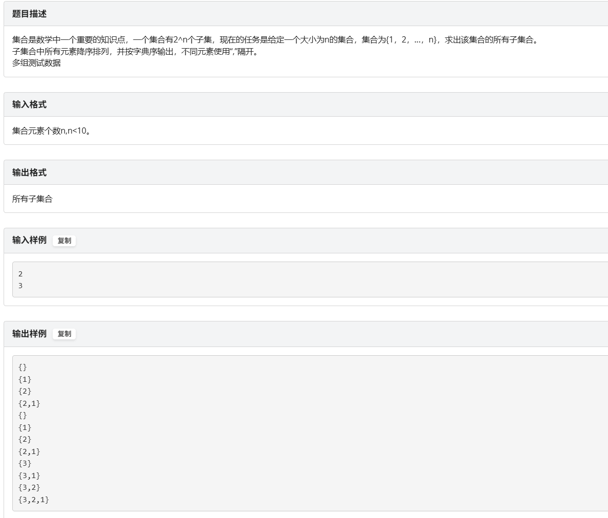
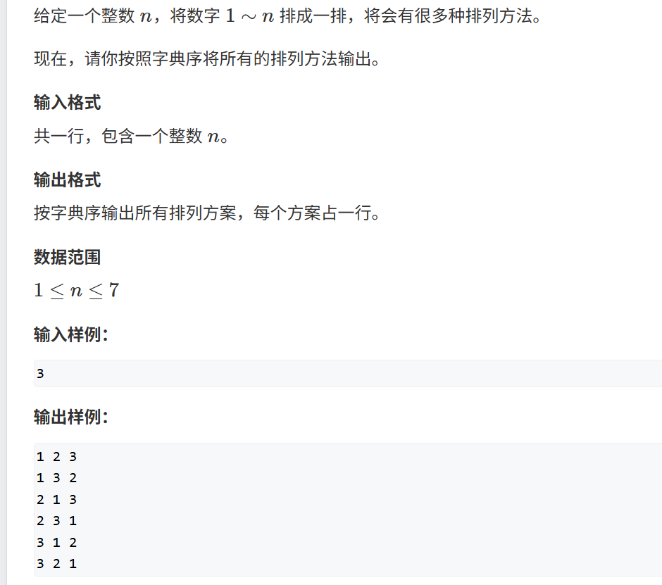
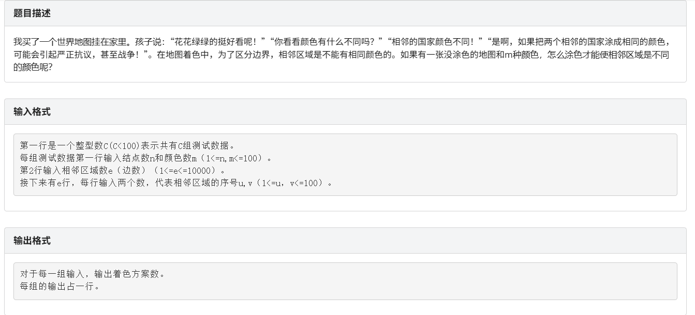
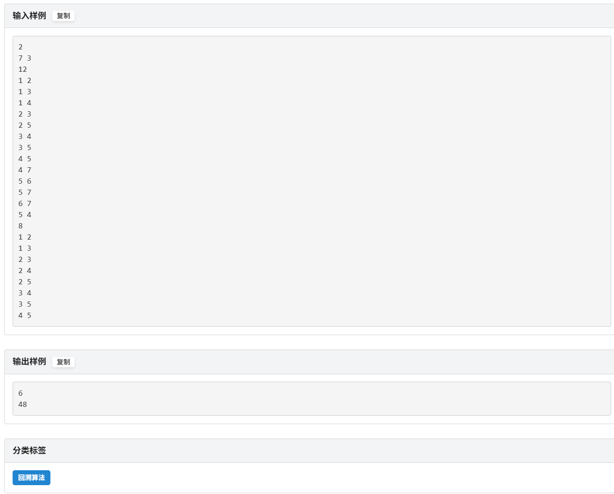
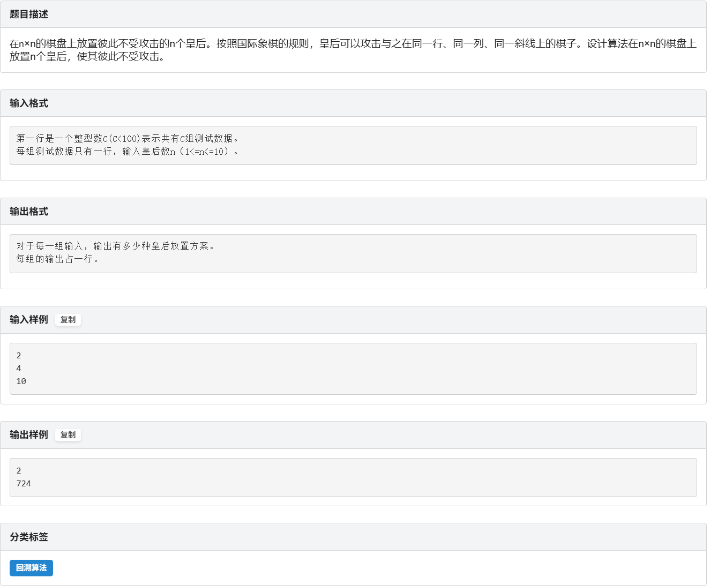
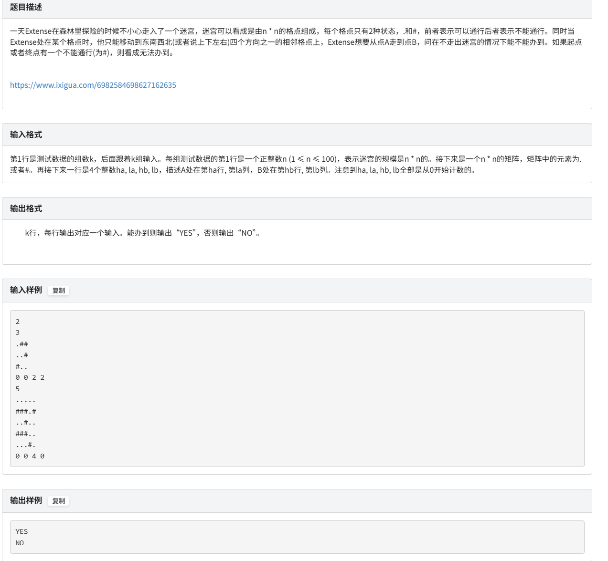

## 回溯题型复习


### 1.幂级问题PowerSet(70%考这个)
  

```cpp
#include <iostream>
using namespace std;

const int N = 15;  
int n;
int path[N];  
int path_len = 0; //当前path中的元素个数

void dfs(int cur) {
    //输出当前子集
    cout << "{";
    for (int i = 0; i < path_len; i++) {
        if (i > 0) cout << ",";
        cout << path[i];
    }
    cout << "}" << endl;

    //尝试从 cur到 n的每个元素
    for (int i = cur; i <= n; i++) {
        path[path_len++] = i;  //选中元素 i
        dfs(i + 1);     //递归进入下一层
        path_len--;          
    }
}

int main() {
    cin >> n;
    dfs(1);
    return 0;
}

```
#### *我服了，在OJ上做这道题的时候，回溯方法太难过了，真的服了，如果逆序输出的话100%过不了，真的服了，所以现在重新把OJ上的题目写一下题解，必须用位运算来做，真的服了靠...* 
   

```cpp
#include <iostream>
using namespace std;

int main() {
    int n;
    while (cin >> n) {
        int total = 1 << n; //2^n 个子集
        for (int mask = 0; mask < total; ++mask) {
            cout << "{";
            bool first = true;
            for (int i = n - 1; i >= 0; --i) { //逆序输出元素
                if (mask & (1 << i)) {
                    if (!first) cout << ",";
                    cout << (i + 1);
                    first = false;
                }
            }
            cout << "}" << endl;
        }
    }
    return 0;
}

```


### 2. 排列问题Permutation(这个是最经典的回溯，因为太简单不知道考不考,50%考这个)


```cpp
#include<iostream>
#include<algorithm>
using namespace std;
int n;
const int N = 10;
int vis[N]={0};
int a[N];
int path[N];

void dfs(int u){
    if(u>=n+1){
        for(int i=1;i<=n;i++)cout<<path[i]<<" ";
        puts("");
    }
    for(int i=1;i<=n;i++){
        if(vis[i]==0){
            path[u] = i;
            vis[i] = 1;
            dfs(u+1);
            vis[i]=0;
        }
    }
    
}

int main(){
    cin>>n;
    dfs(1);
    return 0;
    
}
```

### 3. 最大团问题(40%考这个，个人感觉不会考，反正我也没看这个，若是需要请自行复习)

### 4. 图的m着色问题（MColor）(65%考这个)



```text
具体思路:
图输入 → 建图（邻接矩阵）
          ↓
 DFS 回溯搜索从顶点1开始：
      每个顶点尝试所有颜色
      ↙          ↘
   如果合法   如果冲突，跳过
      ↓
  递归下一个顶点
      ↓
所有顶点染色完毕就计数+1

```

```cpp
//采用DFS(回溯枚举) 
//大致思路
// 1.建图(用邻接矩阵bool adj[N+1][N+1]或者邻接表存下哪些顶点两两相邻)
// 2.维护颜色数组(定义int color[N+1],color[u]表示顶点u被染成的颜色-取值1.....K)
// 3. DFS枚举第u个顶点 

#include <iostream>
#include <cstring>
using namespace std;

const int MAXN = 100;  
bool adj[MAXN+1][MAXN+1];  //邻接矩阵：adj[u][v]=true表示u和v相邻
int color[MAXN+1];  //color[i]表示第i个顶点的颜色（1~K）
long long ans;
int N, K;

//从顶点u开始染色
void dfs(int u) {
    if (u > N) {
        //全部染完，计数加一
        ans++;
        return;
    }
    //尝试给 u 染 1..K 号颜色
    for (int c = 1; c <= K; c++) {
        bool ok = true;
        //检查和所有已染的邻居 v 是否冲突
        for (int v = 1; v < u; v++) {
            if (adj[u][v] && color[v] == c) {
                ok = false;
                break;
            }
        }
        if (!ok) continue;
        //不冲突就染上
        color[u] = c;
        dfs(u+1);
        //回溯
        color[u] = 0;
    }
}

int main(){
//    ios::sync_with_stdio(false);
//    cin.tie(nullptr);

    int T;
    cin >> T;
    while (T--) {
        cin >> N >> K;
        int E;
        cin >> E;
        //清空
        memset(adj, 0, sizeof(adj));
        memset(color, 0, sizeof(color));
        ans = 0;

        //读边
        for (int i = 0; i < E; i++) {
            int x, y;
            cin >> x >> y;
            adj[x][y] = adj[y][x] = true;
        }

        //从顶点 1 开始染色
        dfs(1);

        //输出方案数
        cout << ans << "\n";
    }
    return 0;
}
```

### 5.N 皇后问题（Queen）(特别经典的一道题,在OJ上对应题目"一山不容二虎",acwing也将其作为例题来做,我要是出题人,我就出这个,85%考这个吧我感觉)


```cpp
//n皇后问题(经典搜索) 
//参考ACWING算法基础课  n皇后问题 
//皇后问题

#include<iostream>
#include<cstring>
using namespace std;
const int N = 20;
int n;
int t; 
//char g[N][N];
bool col[N], dg[N], udg[N];   //dg是对角线,udg是反
int cnt = 0;
 
void dfs(int u)  //u可以理解为行
{
	if(u==n)  //搜索完并且安置好每个点是啥了
	{
		cnt++;
		return;
	}
	for(int i=0;i<n;i++)
	{
		if(!col[i]&&!udg[u+i]&&!dg[i-u+n])   //+n是为了偏移避免负值. 剪枝(对于不满足要求的点，不再继续往下搜索)  
		{
			//放一个皇后 
			col[i] = udg[u + i] = dg[i - u + n] = true;    //不同b对应不同对角线
			dfs(u + 1);
			//恢复现场
			col[i] = udg[u + i] = dg[i - u + n] = false;
		}
	}
}
int main()
{
	cin>>t;
	while(t--){
		cin >> n;
		cnt = 0;
		memset(col,0,sizeof(col));
		memset(dg,0,sizeof(col));
		memset(udg,0,sizeof(col));
		dfs(0);
		cout<<cnt<<endl;
	}
	
	return 0;
}

//
//#include<iostream>
//using namespace std;
//const int N = 20;
//int n;
//char g[N][N];
//bool col[N], dg[N], udg[N];   //dg是对角线,udg是反
//void dfs(int u)  //u可以理解为行
//{
//	if(u==n)  //搜索完并且安置好每个点是啥了
//	{
//		for (int i = 0; i < n; i++)cout<<g[i]<<endl;  //这里等价于 二重循环i++,j++  输出g[i][j]
//		puts("");
//		return;
//	}
//	for(int i=0;i<n;i++)
//	{
//		if(!col[i]&&!udg[u+i]&&!dg[i-u+n])   //+n是为了偏移避免负值. 剪枝(对于不满足要求的点，不再继续往下搜索)  
//		{
//			g[u][i] = 'Q';
//			col[i] = udg[u + i] = dg[i - u + n] = true;    //不同b对应不同对角线
//			dfs(u + 1);
//			//恢复现场
//			col[i] = udg[u + i] = dg[i - u + n] = false;
//			g[u][i] = '.';
//		}
//	}
//}
//int main()
//{
//	cin >> n;
//	for (int i = 0; i < n; i++)
//		for (int j = 0; j < n; j++)
//			g[i][j] = '.';
//	dfs(0);
//	return 0;
//}


```

### 6. 回溯搜索必刷-走迷宫


```cpp
//BFS走迷宫
//该题解参考了acwing y总的写法,在上学期数据结构期末考试考的原题,按照自己的方法来就行了
#include <bits/stdc++.h>
using namespace std;
 
const int N = 105;
int n, m, t;
char g[N][N];
bool vis[N][N];
 
int dx[4] = {0, 1, 0, -1};
int dy[4] = {1, 0, -1, 0};
 
typedef pair<int,int>PII;
 
void solveBFS() {
    cin >> n;       
    for (int i = 0; i < n; i++) {
        for (int j = 0; j < n; j++) {
            cin >> g[i][j];    
            vis[i][j] = false; //清空访问标记
        }
    }
    int sx, sy, ex, ey;
    cin >> sx >> sy >> ex >> ey;  
 
    queue<PII> q;
    if (g[sx][sy] == '.') {
        q.push({sx,sy});
        vis[sx][sy] = true;
    }
 
    bool ok = false;
    while (!q.empty()) {
        PII start = q.front();  //让start点 等于 队列首个点
        q.pop(); //删除q队列首个点
 
        if (start.first==ex && start.second==ey) {
            ok = true;
            break;
        }
        int x = start.first;
        int y = start.second;
        for (int d = 0; d < 4; d++) {
            int nx = x + dx[d], ny = y + dy[d];
            if (nx>=0 && nx<n && ny>=0 && ny<n&& !vis[nx][ny] && g[nx][ny]=='.') {
                vis[nx][ny] = true;
                q.push({nx,ny});
            }
        }
    }
 
    cout << (ok ? "YES\n" : "NO\n");
}
 
int main(){
//    ios::sync_with_stdio(false);
//    cin.tie(nullptr);
 
    cin >> t;
    while (t--) solveBFS();
    return 0;
}
```

##### *以下附上Acwing 原题代码,超级优美的写法,仅供参考*
```cpp
//BFS走迷宫
#include<iostream>
#include<queue>
#include<cstring>//memset 头文件
using namespace std;

const int N = 110;
int m, n;
int g[N][N];//储存点
int d[N][N] = {0};//储存距离
typedef pair<int, int>PII;

void bfs(int a,int b)
{
	queue<PII> q;//储存每一步走到的点    队列q，建议画图理解
	q.push({ a,b });

	while(!q.empty())  //画图理解，当q队列里没有点(后面有pop删除点)
	{
		PII start = q.front();  //让start点 等于 队列首个点

		q.pop(); //删除q队列首个点

		int dx[4] = { 0,1,0,-1 }, dy[4] = { -1,0,1,0 };//向量
		for(int i=0;i<4;i++)
		{
			int x = start.first + dx[i], y = start.second + dy[i]; //上下左右走四种情况

			if(g[x][y]==0)
			{
				//走到这个点，计算距离

				g[x][y] = 1;//标记表示走过了
				d[x][y] = d[start.first][start.second] + 1;

				q.push({ x,y });
			}
		}
	}
	cout << d[n][m];
}

int main() {
	memset(g, 1, sizeof(g));
	cin >> n >> m;
	for(int i=1;i<=n;i++)
		for(int j=1;j<=m;j++)
		{
			cin >> g[i][j];
		}
	bfs(1, 1);
	return 0;
}
```


